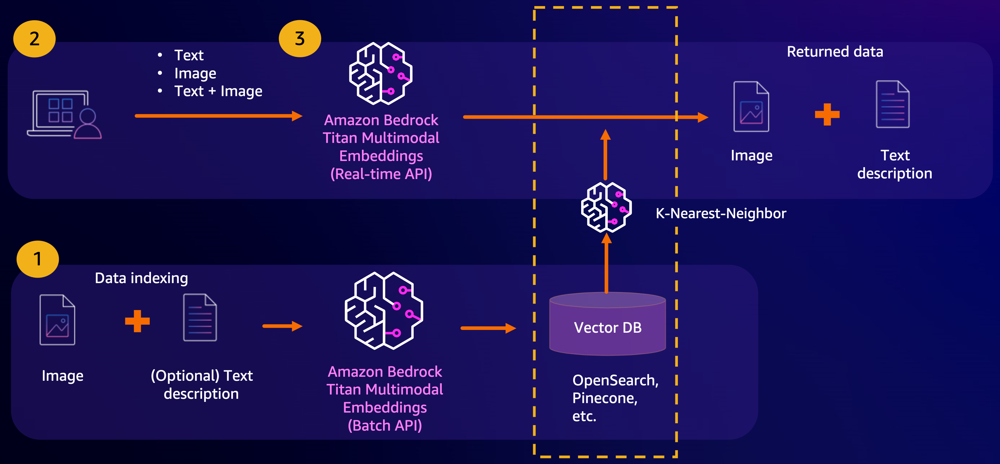

# Lab 5 - Image Generation

## Overview

Image generation can be a tedious task for artists, designers and content creators who illustrate their thoughts with the help of images. With the help of Foundation Models (FMs) this tedious task can be streamlined to just a single line of text that expresses the thoughts of the artist, FMs can be used for creating realistic and artistic images of various subjects, environments, and scenes from language prompts.

Imge indexing and searching is another tedious exterprise task. With the help of FMs, enterprise can build multimodal image indexing, searching and recommendation applications quickly. 

In this lab, we will explore how to use FMs available in Amazon Bedrock to generate images as well as modify existing images, and how to use FMs to do multimodal image indexing and searching.

## Image Prompting

Writing a good prompt can sometimes be an art. It is often difficult to predict whether a certain prompt will yield a satisfactory image with a given model. However, there are certain templates that have been observed to work. Broadly speaking, a prompt can be roughly broken down into three pieces: 

    (i) type of image (photograph/sketch/painting etc.), and
    (ii) description (subject/object/environment/scene etc.), and
    (iii) the style of the image (realistic/artistic/type of art etc.). 
   
You can change each of the three parts individually, to generate variations of an image. Adjectives have been known to play a significant role in the image generation process. Also, adding more details help in the generation process.To generate a realistic image, you can use phrases such as “a photo of”, “a photograph of”, “realistic” or “hyper realistic”. 

To generate images by artists you can use phrases like “by Pablo Picasso” or “oil painting by Rembrandt” or “landscape art by Frederic Edwin Church” or “pencil drawing by Albrecht Dürer”. You can also combine different artists as well. To generate artistic image by category, you can add the art category in the prompt such as “lion on a beach, abstract”. Some other categories include “oil painting”, “pencil drawing", “pop art”, “digital art”, “anime”, “cartoon”, “futurism”, “watercolor”, “manga” etc. You can also include details such as lighting or camera lens, such as 35mm wide lens or 85mm wide lens and details about the framing (portrait/landscape/close up etc.).

Note that the model generates different images even if same prompt is given multiple times. So, you can generate multiple images and select the image that suits your application best.

## Foundation Models

To provide these capabilities, Amazon Bedrock supports [Stable Diffusion XL](https://stability.ai/stablediffusion) for image generation from Stability AI, Titan Image Generator model for image generation from Amazon, and Titan Multimodal Embeddings model for multimodal image indexing and searching. 

### Stable Diffusion

Stable Diffusion works on the principle of diffusion and is composed of multiple models each having different purpose:

1. The CLIP text encoder;
2. The VAE decoder;
3. The UNet, and
4. The VAE_post_quant_conv

The workings can be explained with this architecture:

### Titan Image Generator

Titan Image Generator G1 is an image generation model. It generates images from text, and allows users to upload and edit an existing image. Users can edit an image with a text prompt (without a mask) or parts of an image with an image mask, or extend the boundaries of an image with outpainting. It can also generate variations of an image.

### Titan Multimodal Embeddings

Titan Multimodal Embeddings Generation 1 (G1) is a multimodal embeddings model for use cases like searching images by text, image, or a combination of text and image. Designed for high accuracy and fast responses, this model is an ideal choice for search and recommendations use cases.

## Target Audience

Marketing companies, agencies, web-designers, and general companies can take advantage of this feature to generate brand new images, from scratch.

## Patterns

In this workshop, you will be able to learn about Image Generation using Amazon Bedrock starting with text or image input. Use Stable Diffusion as an example in the below graph, and Titan Image Genrator can also be used for the same purpose. You will also learn about multimodal image indexing and searching.

1. Text to Image
    
2. Image to Image (Inpainting and Outpainting (Titan Image Generator only))
    
3. Multimodal Embeddings
    

## Setup
Before running any of the labs in this section ensure you've run the [Bedrock boto3 setup notebook](../00_Intro/bedrock_boto3_setup.ipynb#Prerequisites).

## Helper
To facilitate image generation, there is a utility class `Bedrock` implementation in `/utils/bedrock.py`. This helps you to generate images easily.

You can also explore different `style_preset`  options [here](https://platform.stability.ai/docs/features/animation/parameters#available-styles).
